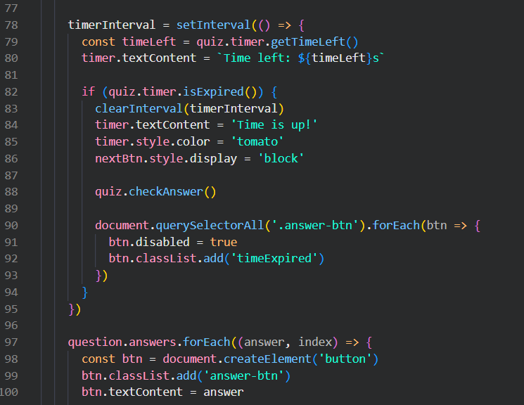
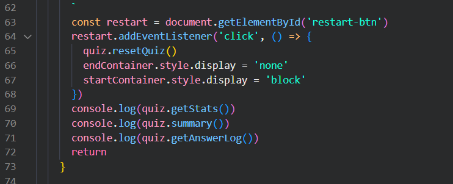
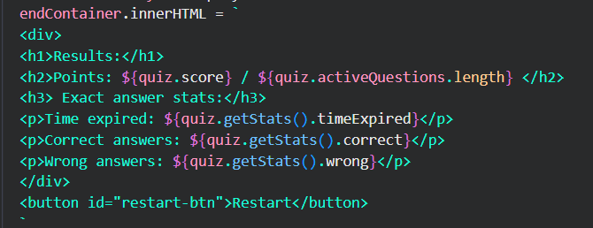
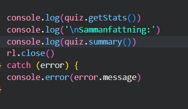
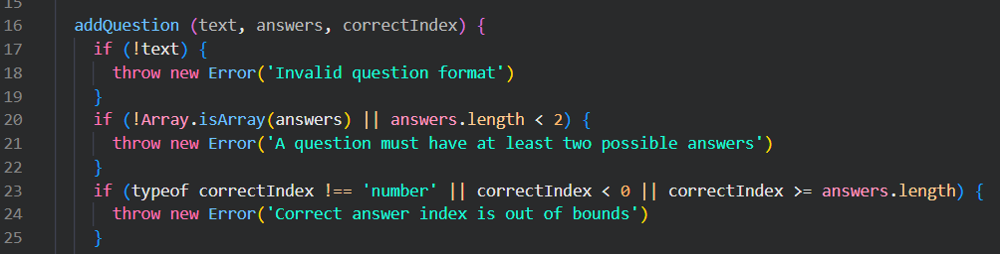
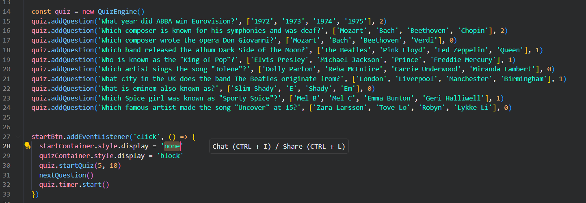

# Reflektion clean code
(Jag har inte än gjort ändringar i modulen än eftersom jag aldrig lämnade in den ordentligt eftersom jag inte va klar så jag kryssade i "detta är ett utkast och behöver inte rättas nu". Men jag har iallafall tänkt på förbättringar jag skulle kunna göra osv)

## Reflektion kap 2

Det jag lärt mig mest av boken relaterat till min kod är avoid disinformation och add meaningful context. Jag hade en del problem med detta i min modul där jag hellre skrev korta namn istället för långa och beskrivande. Jag hade exempelvis namnet currentQ på en variabel, som i efterhand känns otydlig eftersom det inte är självklart vad "Q" står för, särskilt för andra utvecklare som ska förstå eller vidareutveckla modulen. Jag tycker dock att mina namn i min modulapp är bra, förklarande och inte missledande som många av mina andra var.

## Reflektion kap 3

Jag har av kapitel 3 insett att jag ofta bryter mot do one thing i min modul, där har jag metoder som hanterar logik, utskrift och tillstånd samtidigt. Jag har även insett att jag gjort samma misstag i min modulapp, jag har just nu funktionen nextQuestion som gör nästan allt i min kod vilket kan vara förvirrande och det hade varit bättre att dela upp den i mindre delar. 

Här är ett exempel på en del av funktionen där den bland annat hanterar timeouts och skapar svarsknappar.

## Reflektion kap 4

Jag har alltid kommenterat mycket i min kod och efter att ha läst kapitel 4 så har jag lärt mig att det är mycket viktigare att städa upp koden istället för att lägga till kommentarer. De nämner i boken "Explain yourself in code", det har lärt mig att det går alltid att göra metoder mer självförklarande istället för att ha förklarande kommentarer. Jag använder mig ofta av bad comments när jag skriver som ofta bara förklarar igen vad saker gör så jag snabbt hittar, förstår och kommer ihåg vad jag skrivit men som boken förklarar "they are crutches or excuses for poor code".

## Reflektion kap 5

När det kommer till formatering känns det som att jag redan hade stor koll på, både meningen med det och hur man ska formatera. Läsbarheten är väldigt viktig i kod och jag tycker att jag lyckats bra med det för det mesta, men jag insåg att i min funktion nextQuestion() så ser det lite blockigt ut på vissa delar och jag hade kunnat lägga till lite mer vertical openness - Alltså lägga till lite fler mellanrum när nya saker händer.

Här är ett exempel på där jag tycker att det ser en aning blockigt ut just nu. Jag hade exempelvis lagt ett whitespace under const restart och innan den första console.log().

## Reflektion kap 6

Jag lärde mig om att undvika getters och setter om det inte behövs då de ger tillgång till inre data. Som exempelvis i min kod för modulappen så använder jag mig av bland annat quiz.stats.correct men det hade varit bättre att använda sig av quiz.getStats(). Jag läste även om train wrecks vilket jag tänkte på att undvika när jag skrev min kod för testappen till modulen. Jag har console.log(quiz.summary()) och där hade man kunnat skriva quiz.AnswerLog.getSummary() istället men då går det som sagt emot att undvika långa kedjor. 

## Reflektion kap 7

Kapitel 7 av boken lärde mig att det är bra att starta koden med try/catch, även att det är viktigt att använda undantag som try/catch istället för att returnera felkoder. Jag har med en del undantag i min kod som exempelvis i min modul har throw new error för att hantera fel med att lägga till frågor. Men det mesta jag har lärt mig är att try/catch är en stor del av felhantering och jag borde ha med mer av det i min kod för att förhindra risken för kraschar.

## Reflektion kap 8

I min kod använder jag mig en del av console.log() för att kunna hålla koll på att de rätta statsen (antal rätt, fel och timeouts) skrivs ut och loggas. Boken förklarar third-party code och jag har lärt mig mer om hur jag har använt det. Som sagt, jag har använt mig mycket av console.log() och det hade varit bättre att göra en funktion som exempelvis printSummary(). Det hade gjort det lättare att sedan ändra i koden eftersom istället för att begöva ändra hela appen så hade jag kunnat ändra i funktionen.

## Reflektion kap 9

Jag har inte gjort några automatiska tester till min modul eller modulapp men jag har ändå lärt mig nya saker om enhetstester av boken. En testkod ska vara ren och tydlig för som boken förklarar "having dirty tests is equivilant to, if not worse than, having no tests.". Det är även viktigt att man testar en sak i taget eller har ett koncept per test eftersom det annars kan bli förvirrande att förstå vad som testas. Jag läste även om F.I.R.S.T. och det har gett mig en stor inblick för nästa gång jag ska skriva automatiska tester då det är en väldigt bra beskrivning på vad man ska tänka på.  

## Reflektion kap 10

Kapitel 10 förklarar att klasser ska vara små och ha tydliga ansvar. Min quizEngine klass i min modul hade nog kunnat delas upp mer då den är väldigt stor och det är mycket som händer. Boken berättar även att en klass ska ha lite publika metoder och det är något jag inte har, jag måste ändra metoder som används internt till privata då de bara ska vara där för att stödja de publika metoderna. 

## Reflektion kap 11

Kapitel 11 har lärt mig mer om hur min modulapp är uppbygt som ett system. Jag har insett att jag ofta blandar logisk som borde vara separerad som exempelvis att jag både initierar och startar mitt quiz med samma funktion. Det hade varit bättre att dela upp det i exempelvis quizSetup() och initiateQuiz() för att göra det tydligare. 

Exempelvis här dela upp frågorna i en funktion och starta quizet i en annan.

