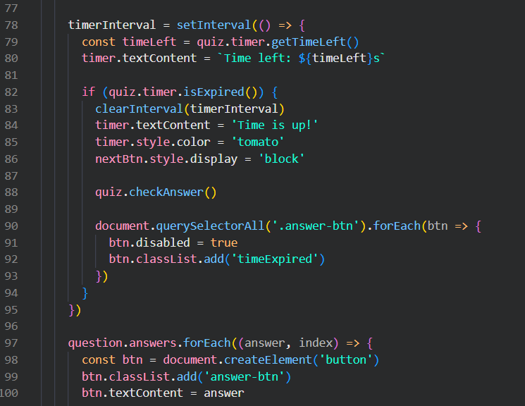

# Reflektion clean code
(Jag har inte än gjort ändringar i modulen än eftersom jag aldrig lämnade in den ordentligt eftersom jag inte va klar så jag kryssade i "detta är ett utkast och behöver inte rättas nu". Men jag har iallafall tänkt på förbättringar jag skulle kunna göra osv)

## Reflektion kap 2

Det jag lärt mig mest av boken relaterat till min kod är avoid disinformation och add meaningful context. Jag hade en del problem med detta i min modul där jag hellre skrev korta namn istället för långa och beskrivande. Jag hade exempelvis namnet currentQ på en variabel, som i efterhand känns otydlig eftersom det inte är självklart vad "Q" står för, särskilt för andra utvecklare som ska förstå eller vidareutveckla modulen. Jag tycker dock att mina namn i min modulapp är bra, förklarande och inte missledande som många av mina andra var.

## Reflektion kap 3

Jag har av kapitel 3 insett att jag ofta bryter mot do one thing i min modul, där har jag metoder som hanterar logik, utskrift och tillstånd samtidigt. Jag har även insett att jag gjort samma misstag i min modulapp, jag har just nu funktionen nextQuestion som gör nästan allt i min kod vilket kan vara förvirrande och det hade varit bättre att dela upp den i mindre delar. 

Här är ett exempel på en del av funktionen där den bland annat hanterar timeouts och skapar svarsknappar.

## Reflektion kap 4

Jag har alltid kommenterat mycket i min kod och efter att ha läst kapitel 4 så har jag lärt mig att det är mycket viktigare att städa upp koden istället för att lägga till kommentarer. De nämner i boken "Explain yourself in code", det har lärt mig att det går alltid att göra metoder mer självförklarande istället för att ha förklarande kommentarer. Jag använder mig ofta av bad comments när jag skriver som ofta bara förklarar igen vad saker gör så jag snabbt hittar, förstår och kommer ihåg vad jag skrivit men som boken förklarar "they are crutches or excuses for poor code".

## Reflektion kap 5

## Reflektion kap 6

## Reflektion kap 7

## Reflektion kap 8

## Reflektion kap 9

## Reflektion kap 10

## Reflektion kap 11
